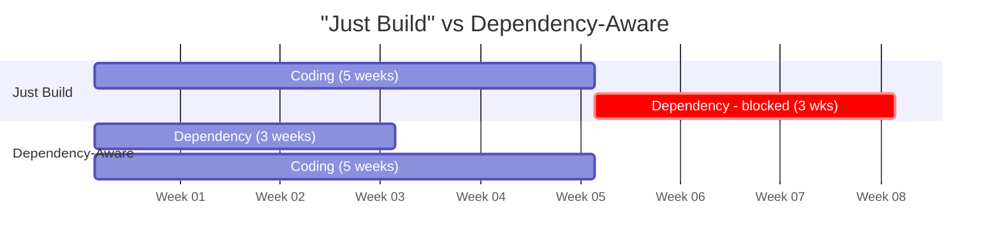

Here's a puzzle: most product software engineers _know_ they should kick off
dependencies early, write a brief design doc before coding, and schedule the
launch review before they need it. They've been burned before. They've seen
projects slip. And yet, the pull toward "just start building" is almost
irresistible.

This isn't a knowledge gap. It's a psychology gap. And closing it is a big part
of what separates more effective engineers from less effective ones.

_A quick note on scope: This advice applies to "Execution Mode", not "Discovery
Mode". If you're still prototyping to see if an idea is possible, by all means:
just build it. But the moment you commit to shipping a production feature,
that's when to pause and ask: what are the dependencies I can kick off today?_

## Product Work Is More Parallel Than It Feels

When you're new to product engineering, work feels sequential. You think: _I'll
build the feature, then get it reviewed, then handle edge cases, then do the
launch checklist_. This is intuitive. It's how we're taught to solve problems —
one step at a time.

But experienced engineers have learned, usually through painful experience, that
product work is far more parallel than it appears. The legal review that takes
three weeks? You can kick that off on day one, before you've written a line of
code. The API you'll need from the platform team? Request it while you're still
sketching the design. The security review? Get it in the queue while you're
prototyping.

The "just build" engineer codes for five weeks, then discovers a three-week
dependency, and ships in eight. The dependency-aware engineer kicks it off on
day one, builds in parallel, and ships in five. Same work, different sequencing,
dramatically different outcome.

Fred Brooks touched on this in
[_The Mythical Man-Month_](https://en.wikipedia.org/wiki/The_Mythical_Man-Month)
with his rule of thumb that coding is only 1/6th of the schedule. Our intuition
fails to account for the true critical path. We look at a project and see a
straight line of implementation, ignoring the sequential chains of testing and
system integration that actually determine the ship date. The long poles are
usually external dependencies, reviews, and coordination — exactly the things
that feel like "not real work."

## Why We Don't Do the Obviously Right Thing

Even engineers who've been burned before fall back into "just start building"
mode. Why? Several psychological forces conspire against us.

**Present bias** makes us overvalue immediate rewards. Writing code gives you
the satisfying feeling of progress _right now_. Sending an email to the legal
team gives you... nothing. The payoff is weeks away, probabilistic, and
invisible when it works (you simply _don't_ get blocked).

**Action bias** is particularly strong in engineering culture. We valorize
shipping. Hackers hack. The engineer who spends their first day "just sending
emails and scheduling meetings" feels like they're not doing real work, even
when that's exactly the highest-leverage activity.

There's also what I'd call the **"should" tax**. Doing the right thing — filling
out the kickoff template, scheduling the pre-launch review, writing up the
rollout plan — often feels like obligation rather than genuine work. Research in
[Self-Determination Theory](https://en.wikipedia.org/wiki/Self-determination_theory)
(Deci & Ryan) shows that even self-imposed "shoulds" are more draining than
intrinsically motivated action. The task isn't hard, but it carries
psychological weight.

And finally, there's **optimism bias**: _my project is simpler, I probably won't
need all those sections in the template, we can figure out the rollback plan
later_. Optimism bias is particularly insidious because it actively discourages
you from kicking off parallel dependencies — after all, you probably won't need
them, right?

## The Orchestration Dimension

Orchestration requires _lead time_.

If you're going to ask someone else to do part of the work, you need to know
what you'll need before you need it. This sounds obvious, but it requires you to
think ahead in a way that's psychologically expensive. You have to model the
project, identify what can be parallelized, and accept that you won't be doing
everything yourself.

Brooks observed that communication overhead increases quadratically with team
size — the famous "adding people to a late project makes it later." But the flip
side is that _well-orchestrated_ parallel work is genuinely faster. The skill is
in the orchestration, not just the execution.

This is also where
[_High Output Management_](https://en.wikipedia.org/wiki/High_Output_Management)
by Andy Grove is illuminating. Grove argues that a manager's output is the
output of their team. I'd extend this: a senior engineer's output is the output
of all the parallel workstreams they've set in motion. The engineer who kicked
off three dependencies on day one has a higher "output" than the one who wrote
more code but is now blocked.

## "But Won't This Add Too Many Cooks?"

A reasonable objection: Doesn't kicking off all these parallel workstreams mean
more people involved, more opinions, more chaos?

Kicking off dependencies isn't the same as inviting opinions:

- **Parallelizing dependencies**: "I need X from you by date Y" (clear handoff)
- **Parallelizing decision-making**: "What do you all think we should build?"
  (design by committee)

The first speeds you up. The second slows you down. The pre-mortem and kickoff
rituals are about identifying _deliverables_ you need from others, not
_opinions_. Legal review is a dependency. A "what does everyone think of my
architecture" Slack thread is a coordination tax.

If you find yourself blocked waiting for consensus rather than deliverables,
that's a sign you've blurred the line.

## How to Develop This Skill

**Do a pre-mortem.** Before you start, ask: "If this project ships two weeks
late, what will the reason be?" The answer is almost always a dependency you
haven't surfaced yet.

**Make parallel work feel like progress.** Reframe "I sent emails requesting
three things" as "I unblocked three parallel workstreams for my project." This
isn't self-deception — it's accurate. Legible progress keeps you motivated and,
if you're reporting status, makes your actual work visible.

**Timebox the orchestration.** If the willpower cost of constantly thinking
"what should I be unblocking?" is too high, contain it. Spend your first hour on
a project _only_ on kickoffs and dependency identification. Set a weekly
15-minute calendar reminder to ask: "What's blocking future-me that present-me
can unblock right now?"

**Earn the fun part.** If you love coding and resent the upfront coordination,
treat the coordination as the price of entry. "I don't get to start building
until I've done the 30-minute setup ritual." This uses your desire for the fun
work as motivation for the necessary work.
